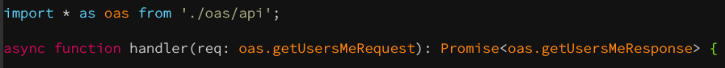

# openapi-generator-template-typescript-models



## Usage

```
$ git clone github.com/acomagu/openapi-generator-template-typescript-models
$ openapi-generator-cli generate -i openapi.yaml -g typescript-node -o out/ -t openapi-generator-template-typescript-models/template
```
